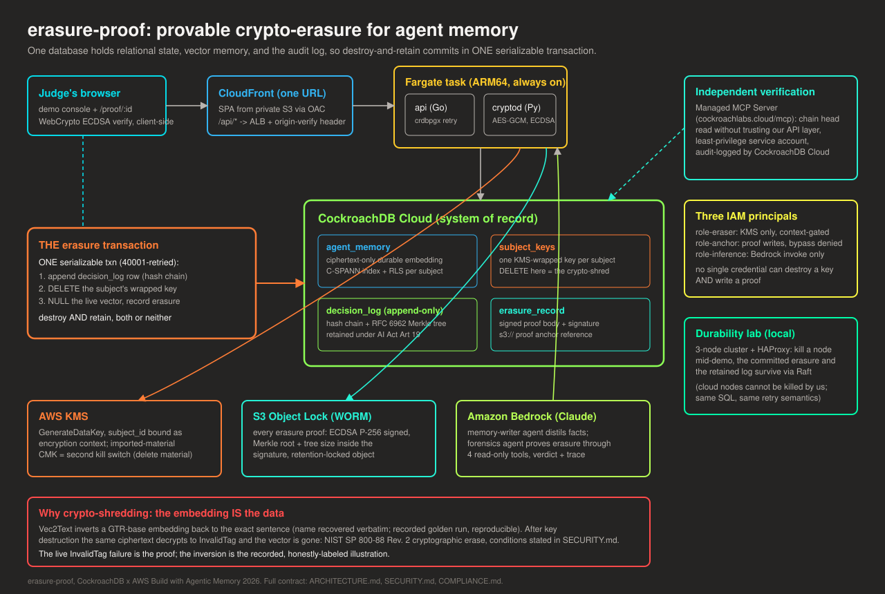

# erasure-proof

**Provable, durable, statute-compliant erasure for AI agent memory, on CockroachDB and AWS.**

[](https://github.com/StephenSook/erasure-proof/actions/workflows/ci.yml)
[](./LICENSE)
[](./services/api)
[](./services/cryptod)
[](./web)
[](https://www.cockroachlabs.com/)
[](./deploy/aws)
[](https://csrc.nist.gov/pubs/sp/800/88/r2/final)

When a regulator asks whether a person's data is truly gone from an AI agent's memory, most
systems can only prove they deleted a row. Deleting the row is not enough: the embedding is still
reconstructible. Text-embedding inversion (Vec2Text, Morris et al., arXiv:2310.06816) recovers
names from the vector alone. This project crypto-shreds the embedding by destroying its key,
atomically retains the legally required decision log in one serializable transaction, emits an
ECDSA-signed proof anchored in write-once storage, and proves the erasure survives a node failure.

This is incident response and compliance for agent memory. It is not detection.

CockroachDB positions itself as the system of record for agentic memory: durable, consistent, and
surviving failure. A system of record for a person's memory is only complete if it can also prove
that memory is gone when the law demands it. That is the gap this project closes, on the same
database that stores the memory in the first place.

> Status: in active development for the CockroachDB x AWS "Build with Agentic Memory" hackathon
> (submission deadline Aug 18, 2026). Component readiness is tracked honestly in the
> [Capability tiers](#capability-tiers) table below and on the app's `/trust` page. Nothing is
> claimed as live until it ships and is verifiable in this repo.

## Surfaces

| Surface | Where |
|---|---|
| Web console | DEPLOYED: one CloudFront URL (provided to judges via the submission form), S3 + Fargate + KMS + S3 Object Lock behind it; also runs locally, see [Setup and run](#setup-and-run) |
| Read-only forensics MCP server | four audit-logged tools over the official MCP SDK (`services/mcpserver`), CI-tested against a real CockroachDB; runs via stdio or streamable HTTP |
| Offline mobile verifier | real now: Expo / React Native, pure-JS P-256, verifies an erasure certificate with no server and no network; Android APK via `eas build`, iOS via the simulator ([mobile/](mobile/)) |
| Full stack, locally | runs today via [Setup and run](#setup-and-run) |

## The one closeable loop

An erasure request arrives -> the system cryptographically destroys the personal embedding so it
cannot be reconstructed -> it atomically retains the pseudonymized decision log the law requires
-> it emits an externally anchored, signed proof -> the erasure holds durably across a node kill.

## Capability tiers (honesty moat)

Every claim in this project is labeled by how far it is actually built. This table is the source
of truth and is mirrored on the app `/trust` page.

| Capability | Tier | Notes |
|-----------|------|-------|
| Schema, least-privilege roles, append-only decision log | wired-live | migrations 0001-0005; CI proves the 42501 rejection |
| C-SPANN vector index (free Basic tier) | wired-live | subject_id prefix; spike 2 findings in `spikes/` |
| AES-256-GCM two-level envelope + KMS key destruction | wired-live | real-AWS smoke + hypothesis property tests |
| SERIALIZABLE destroy-and-retain erasure transaction | wired-live | crdbpgx 40001 retry; atomicity test under injected retries |
| ECDSA-signed proof + S3 Object Lock anchor | wired-live | GOVERNANCE in dev; COMPLIANCE bucket at submission |
| RFC 6962 Merkle transparency log, root signed into proofs | wired-live | `/api/tree-head`, `/api/inclusion`, browser verify |
| Browser-side proof verification (`/proof/:id`) | wired-live | WebCrypto over the exact stored canonical bytes |
| Row-level security scoping the agent per subject | wired-live | fail-closed; full matrix asserted in CI |
| Read-only forensics MCP server (4 tools, audit-logged) | wired-live | DEPLOYED judge-connectable over streamable HTTP at the demo URL's `/mcp` (bearer-gated; token in the judge-only submission field); the live forensics agent runs over the same tools |
| Managed MCP Server verification path | wired-live | `infra/ccloud/mcp-verify.sh` runs as a nightly CI gate (`verify-cloud.yml`); both MCP paths report the same chain head |
| ccloud service-account RBAC boundaries | wired-live | `infra/ccloud/rbac-demo.sh`: control-plane 403 and data-plane 42501 execute live; the MCP-authz boundary is documented in the script header |
| Atomic erasure surviving a node kill | integration | local 3-node rig (managed cloud nodes cannot be killed by us) |
| Vec2Text name-then-noise inversion | integration | recorded golden run (Modal T4), reproducible; live InvalidTag is the proof |
| REGIONAL BY ROW geo-domiciling | integration | optional migration, verified on a local 3-region cluster; NOT enabled on the single-region demo |
| Deployed live demo app | wired-live | judge-facing deploy live since 2026-08-03 (CloudFront + Fargate + KMS + COMPLIANCE Object Lock), keepalive-monitored through judging |
| Live AI forensics agent + memory-writer | wired-live | open-model provider (llama.cpp on a Modal serverless GPU) behind the same interface as Bedrock; every on-screen verdict labels which provider answered; Bedrock becomes primary when its quota is granted |

Tiers used: `wired-live` (runs on the real path today, verifiable from this repo), `integration`
(built and tested, live by necessity elsewhere or landing at the scheduled deploy). No capability
is described in the pitch at a higher tier than it holds here.

## Architecture



See [ARCHITECTURE.md](ARCHITECTURE.md) for the full component contract and data flow,
[SECURITY.md](SECURITY.md) for the threat model and the exact honest conditions on every claim,
and [COMPLIANCE.md](COMPLIANCE.md) for the GDPR Article 17 vs EU AI Act Article 19 reconciliation.

- Go API + erasure orchestrator (pgx + the official `cockroach-go/crdb` 40001 retry wrapper).
- Python microservice for all crypto, KMS, Vec2Text, and the read-only forensics MCP server.
- CockroachDB: serializable transactions, C-SPANN vector index, row-level security, the system of
  record for agent memory.
- AWS: KMS (the erasure mechanism), S3 Object Lock (the proof anchor), Bedrock (agent inference),
  ECS/Fargate (the always-on erasure path).

## Repository layout

```
db/            schema migrations and named SQL queries (README)
services/      api (Go) + cryptod, mcpserver, agents (Python)  (README)
web/           React + Vite frontend                            (README)
deploy/local/  local 3-node CockroachDB cluster + HAProxy       (README)
infra/         ccloud RBAC scaffolding + AWS smoke script       (README)
spikes/        the three week-one gating experiments + findings (README)
tests/         guide to where each guarantee is tested          (README)
docs/          architecture diagram, API contract, demo script  (README)
```

Each directory carries a short README describing its purpose. Top-level docs (ARCHITECTURE,
SECURITY, COMPLIANCE) stay at the root where GitHub surfaces them.

## CockroachDB tools used (all four wired; the hackathon requires two)

- **Distributed Vector Indexing (C-SPANN)**: the live GTR embedding is indexed with a
  `subject_id` prefix, so per-subject similarity search is index-accelerated and the erasure
  purge (setting the vector NULL) is a plain UPDATE the index survives. The console demonstrates
  retrieval live: the similarity search finds the stored memory (the plan line from a real
  EXPLAIN, naming `mem_idx`, is shown on screen), and the same search after erasure finds
  nothing, because the vector itself is destroyed. Verified empirically: any
  non-prefix filter (even `embedding IS NOT NULL`) disqualifies C-SPANN acceleration, so the
  search filters on the prefix column only (`db/queries/memory.sql`). Runs on the free Basic
  tier. We use L2 (Euclidean) `<->` distance; C-SPANN was a preview in v25.2 (L2-only), and the
  current stable docs (v26.2) no longer mark it preview and document L2, cosine, and inner-product.
  Our cluster started on v25.4 LTS; the Basic tier auto-upgrades, and it runs v26.2.1
  (transcript: `infra/ccloud/cluster-version-2026-08-04.json`).
  (`db/migrations/0003_vector_index.sql`, spike 2 findings.)
- **Managed MCP Server**: the independent verification path. A least-privilege service account
  reads the decision-log chain head through `cockroachlabs.cloud/mcp` (`select_query`), so a
  verifier does not have to trust our API layer, and every call is audit-logged by CockroachDB
  Cloud. (`infra/ccloud/mcp-verify.sh`.)
- **ccloud CLI (service-account RBAC)**: provisions the cloud cluster and demonstrates three
  DISTINCT denial boundaries live: control-plane HTTP 403, MCP-layer Cloud-RBAC refusal, and
  data-plane SQLSTATE 42501 on the append-only log. (`infra/ccloud/rbac-demo.sh`.)
- **Agent Skills**: a `verifying-cryptographic-erasure` skill authored in this repo
  (`skills/`), following upstream `cockroachlabs/cockroachdb-skills` conventions and validated
  with their own `validate-spec.py` (zero errors); the upstream contribution PR is in flight.

Earned feedback on all four tools: [docs/feedback-cockroachdb-tools.md](docs/feedback-cockroachdb-tools.md).

## AWS services used (all load-bearing; the hackathon requires one)

- **AWS KMS**: the erasure mechanism itself. Per-subject envelope keys via GenerateDataKey with
  `subject_id` bound as encryption context; deleting the wrapped-key row is the crypto-shred,
  and imported-material subjects carry a second kill switch (DeleteImportedKeyMaterial, proven
  against real KMS). The proof signer is also KMS: an asymmetric ECC_NIST_P256 key signs every
  proof inside KMS, so the ECDSA private key never exists in any service process. Signing
  permission is attached to the anchor capability policy and never the eraser's, so the
  capability that destroys keys cannot sign proofs; the per-capability assume-role flip that
  enforces this split at runtime is documented in `deploy/aws/iam.tf`.
- **Amazon S3 Object Lock**: every erasure proof is ECDSA-signed and anchored to a WORM bucket
  (GOVERNANCE in development, COMPLIANCE for the judged proofs).
- **Amazon Bedrock (Claude)**: the memory-writer agent distils durable facts via real inference;
  the forensics agent proves an erasure through the four read-only tools and returns a verdict
  with its trace.
- **Amazon Bedrock (Titan v2)**: the console's side-by-side panel embeds the same memory sentence
  with AWS-native Titan (1024-dim) next to the invertible GTR vector. Stated honestly on the
  panel itself: Titan has no public inverter today, and that absence is not proof of
  irreversibility, which is why erasure destroys the key rather than trusting model obscurity.
  The protected, invertibility-demonstrating vector remains GTR (Vec2Text only inverts models it
  was trained on).
- **Amazon ECS / Fargate**: the always-on, connection-pooled erasure path (Lambda plus a SQL
  database exhausts connections; the deploy stack is `deploy/aws/`).

---

The following sections map to the five equally weighted judging criteria.

## Agentic Memory Design

CockroachDB is the system of record for the full memory lifecycle: write, retrieve, erase, prove.
The `agent_memory` row stores the embedding only as ciphertext for durability, plus a live
plaintext vector that C-SPANN indexes for search; two-level per-subject envelope keys make each
subject's memory independently destroyable with one row deletion; row-level security scopes the
agent to the single subject its session declares, fail-closed; and the hash-chained, Merkle-treed
`decision_log` is itself retained agent memory, with each memory's ciphertext bound to the chain
head it observed (AES-GCM associated data). The console also proves the motivating claim with the
database's own features: a normally-DELETEd row read back live via `AS OF SYSTEM TIME` (deletion
is not erasure, within the GC window), and the same C-SPANN similarity search finding a memory
before erasure and nothing after. (Details: [ARCHITECTURE.md](ARCHITECTURE.md).)

## Technical Implementation

The destroy-and-retain erasure runs in one serializable transaction with the official 40001 retry
wrapper (atomicity proven under injected retry errors); AES-256-GCM binds `subject_id || chain
head` as associated data; every erasure emits an ECDSA P-256 proof that signs the decision-log
seq, the erasure's own timestamp, and the RFC 6962 Merkle root and tree size, anchored to S3
Object Lock; the proof verifies in the judge's browser over the exact stored canonical bytes,
with client-side subject binding against replay; the same proof verifies **offline on a phone** via
the companion mobile app ([mobile/](mobile/), Expo/React Native, pure-JS P-256, byte-for-byte
parity with the backend signer) so an auditor can check an erasure certificate with no server and
no network; a genuinely read-only MCP server exposes four forensic tools; and a hypothesis
property-test suite proves decrypt-fails-after-destruction. Under
concurrent erasure the gapless hash chain holds with no lost or duplicated appends, measured to
50-way concurrency with the retry-budget ceiling reported honestly
([docs/concurrency.md](docs/concurrency.md)). (Details: [ARCHITECTURE.md](ARCHITECTURE.md),
[SECURITY.md](SECURITY.md).)

### Put the verifier on your phone

The offline verifier installs on real devices; scan a code and check an erasure certificate with
no server and no network.

| Platform | Install | Scan |
|---|---|---|
| iOS (TestFlight) | [testflight.apple.com/join/Kxe3eKhQ](https://testflight.apple.com/join/Kxe3eKhQ) |  |
| Android (APK, direct) | [Release verifier-v1.0.0](https://github.com/StephenSook/erasure-proof/releases/tag/verifier-v1.0.0) |  |

The iOS build ships through TestFlight, so availability can lag Apple's beta review briefly
after a new build; the Android APK is hosted as a GitHub Release asset so the link does not
expire. Recognized signer fingerprints are listed in the release notes and shown in-app.

## Real-World Impact

GDPR Article 17 compels erasure; EU AI Act Article 19(1) (effective Aug 2, 2026) compels retaining
auto-generated logs; MiFID II sets a longer floor for financial entities. These obligations point
in opposite directions and no single system reconciles them today. (Details:
[COMPLIANCE.md](COMPLIANCE.md).)

The gap is not hypothetical. Peter Borner, interim chair of the Open Proof Standards Foundation
(the body publishing the Privacy Claims Token specification), told us while we validated this
project:

> "I don't know of anyone that can currently identify the obligations placed on data at the time
> of collection. I also don't know of anyone that can then prove they erased the data fully and
> correctly."

A second independent expert reached the same conclusion. Debbie Reynolds, "The Data Diva," Global
Data Privacy and Emerging Technologies Expert, told us:

> "Most organizations still struggle to fully demonstrate end-to-end data erasure. Many rely on
> soft deletion, suppression, or retention schedules rather than immediate, irreversible deletion
> across all systems."

A third independent expert reached the same conclusion in public. Carey Lening, Privacat Insights,
published "Why Provable Data Erasure Is Really Hard, Actually"
([insights.priva.cat](https://insights.priva.cat/p/why-provable-data-erasure-is-really), July 2026),
writing that "most organizations can't prove that data is for reals gone, and truly unrecoverable."
She names the exact condition this project makes central: "even if you do something like key-based
encryption for all files, you still need to prove that you have at least destroyed every copy of the
key." That is precisely the NIST forward-secrecy condition this project states out loud, and
destroying the per-subject key is what it does.

This project answers both halves inside one database: the lawful basis is bound to every memory at
write time in the hash-chained decision log, and every erasure emits a signed, externally anchored
proof. (On the relationship to the emerging PCT standard, see
[COMPLIANCE.md](COMPLIANCE.md#relationship-to-the-privacy-claims-token-pct).)

## Production Readiness

Ten CI jobs (Go race tests against a real CockroachDB, Python property tests under moto, web
typecheck/lint/tests, a mobile job that typechecks and byte-parity-tests the offline verifier,
full-history secret scanning, a db-smoke job that proves the append-only and
locking-privilege invariants as the REAL roles not root, a mock-mode browser E2E, and a real-stack
browser E2E that drives the whole loop with zero mocks over real HTTP, SQL, and crypto against
moto-backed KMS and S3 Object Lock) run on every push, and a nightly node-kill workflow gates the
Raft durability beat (all three runs must survive the kill). The
deploy is code (`deploy/aws/`: one CloudFront URL, always-on Fargate, circuit-breaker rollback,
three separated IAM principals with confused-deputy conditions) and was rehearsed end to end:
deployed, smoked live including a full erase-and-prove loop on the cloud cluster, and torn down
the same day; the rehearsal caught and fixed a real signed-timestamp bug before any judge could
see it. A dormant keepalive workflow with a dead-man ping activates at the judge-facing deploy.
(Details: [SECURITY.md](SECURITY.md), [deploy/aws/README.md](deploy/aws/README.md).)

## Creativity & Originality

The primitive (crypto-shredding) is standard (NIST SP 800-88 Rev. 2) and CyborgDB ships the
encrypted-vector version. The contribution is the combination: a crypto-erased embedding, an
atomically retained decision log structured as an RFC 6962 transparency tree whose signed root
travels inside every proof, and an externally anchored signed proof a browser can verify, on a
database that survives node loss, reconciling GDPR Article 17 against EU AI Act Article 19. Prior
art (CyborgDB, MemLineage, OWASP Agent Memory Guard, Zep) is cited proactively in
[SECURITY.md](SECURITY.md).

## Setup and run

Local full stack (real KMS + real Object Lock dev bucket + role-scoped pools; needs Docker, Go,
uv, Node, and AWS credentials per `.env.example`):

```bash
cp .env.example .env                      # fill in placeholders
bash deploy/local/run-fullstack.sh        # single-node CRDB + cryptod + api, role-scoped
cd web && npm ci && npm run dev           # the console on top
```

Piecewise:

```bash
make cluster-up                 # local 3-node CockroachDB + HAProxy (the durability lab)
make migrate                    # apply db/migrations
make spike3                     # atomic-erasure-survives-node-kill demo
bash deploy/local/rbr-verify.sh # optional REGIONAL BY ROW migration on a 3-region local cluster
bash infra/ccloud/mcp-verify.sh # chain-head verification through the Managed MCP Server
bash infra/ccloud/rbac-demo.sh  # the three RBAC denial boundaries, live
```

The three week-one spikes live in `spikes/` and gate the build; see each `findings.md`.

## License

[Apache-2.0](LICENSE).
